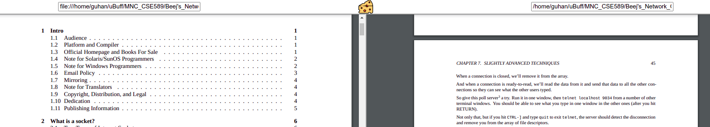

## Cheddar Reader
A very naive implementation to read your PDF Files in a single window with stacked tabes `1x2` layout, will be making the `2x2` layout later.

### Usage
* Open the file `index.html` in local browser or `node index` from the `Cheddar-master` folder then navigate to `localhost:3000`
* Copy the file path with `.pdf` example 
    * `file:///home/Tom/Traps/Dynamite.PDF` - :+1:
    * `home/Tom/Traps/Dynamite.PDF` - :+1:
    * `home/Tom/Traps/Dynamite` - :-1:
    * `<Random Strings>` - :-1:
* Press Tab or click elsewhere from the input box, voila your PDF loads.

### Example

### References
* [Handling File Input - I](https://developer.mozilla.org/en-US/docs/Web/HTML/Element/input/file)
* [Research for handling Files - II](https://medium.com/better-programming/handling-file-inputs-with-javascript-9f2d3a007f05)
* [CSS for iFrames](https://css-tricks.com/snippets/css/a-guide-to-flexbox/)

### Credits
* Cheddar Icon made by [Freepik](https://www.freepik.com) from [Flaticon](https://www.flaticon.com)
* Amazing PDF Reader for Browsers~ [PDF.js](https://mozilla.github.io/pdf.js/)